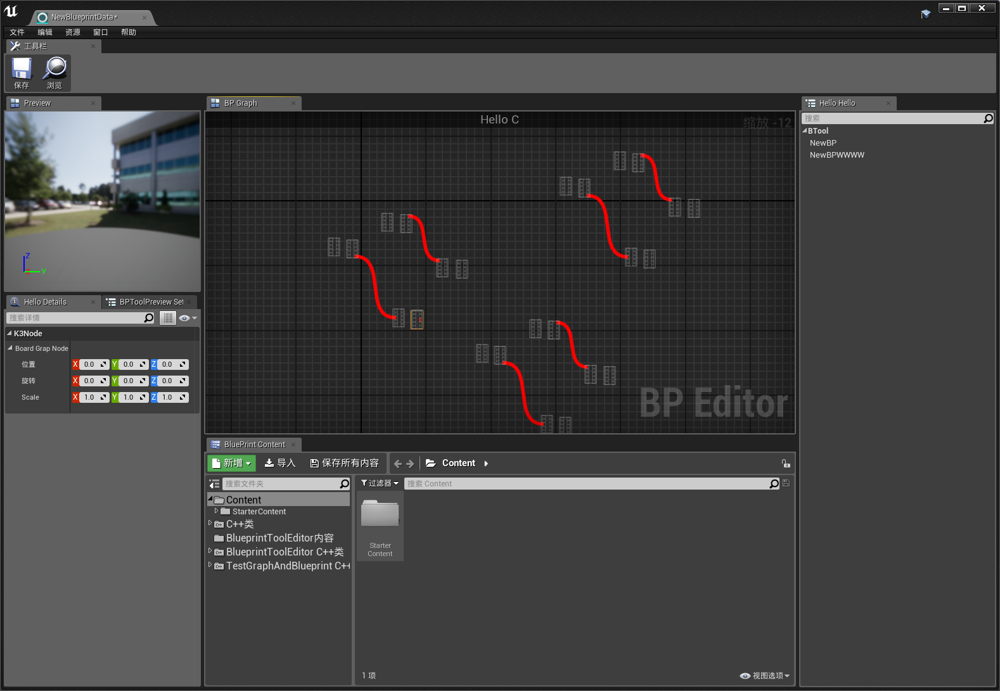

# DIY_BlueprintEditor
 一个ue独立窗口插件，拼了编辑器界面，实现了diy蓝图节点的复制撤销粘贴拖拽，显示数据反射

# 蓝图界面框架

这是一个专为 Unreal Engine 4  设计的编辑器界面框架。该框架结合了 Slate 和 UMG 的优势，为自定义蓝图节点和引脚的构建提供了一套强大而用户友好的环境。

## 特性

- **Slate 界面框架**：核心界面采用 Slate 构建，提供了灵活而强大的 UI 设计系统。
- **UMG & Slate 定制**：将 UMG 的易用性与 Slate 的强大功能结合起来，创建自定义蓝图节点和pin。
- **蓝图节点功能**：集成蓝图节点操作，如复制、粘贴、撤销和重做。
- **反射数据映射**：能够将反射数据映射到细节面板，增强了蓝图节点及其属性之间的工作流程。
- **拖放交互**：在蓝图画布和蓝图列表等标签页之间实现直观的拖放互动，为用户提供更流畅的体验。

## 文档

浏览[蓝图界面框架文档](https://www.yuque.com/shaozi-3mfdw/rqgtq3/mybuf24yoq8fs7pb](https://www.yuque.com/shaozi-3mfdw/vg35e0/td4yk47k162wziim)https://www.yuque.com/shaozi-3mfdw/vg35e0/td4yk47k162wziim)获取详细的教程、特性解释和 API 参考，帮助您开始使用界面框架。

## 使用环境

源代码环境：UE4.22
